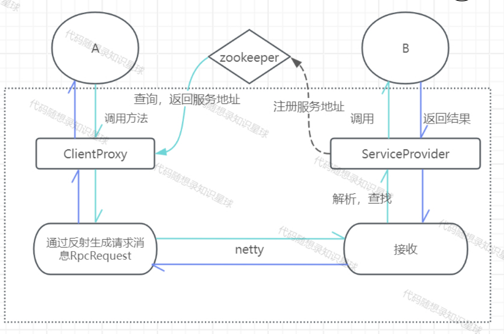
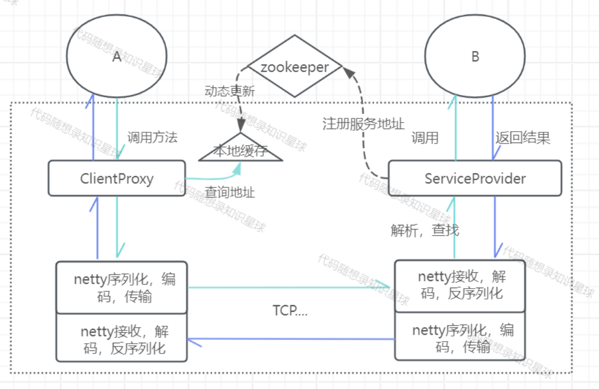
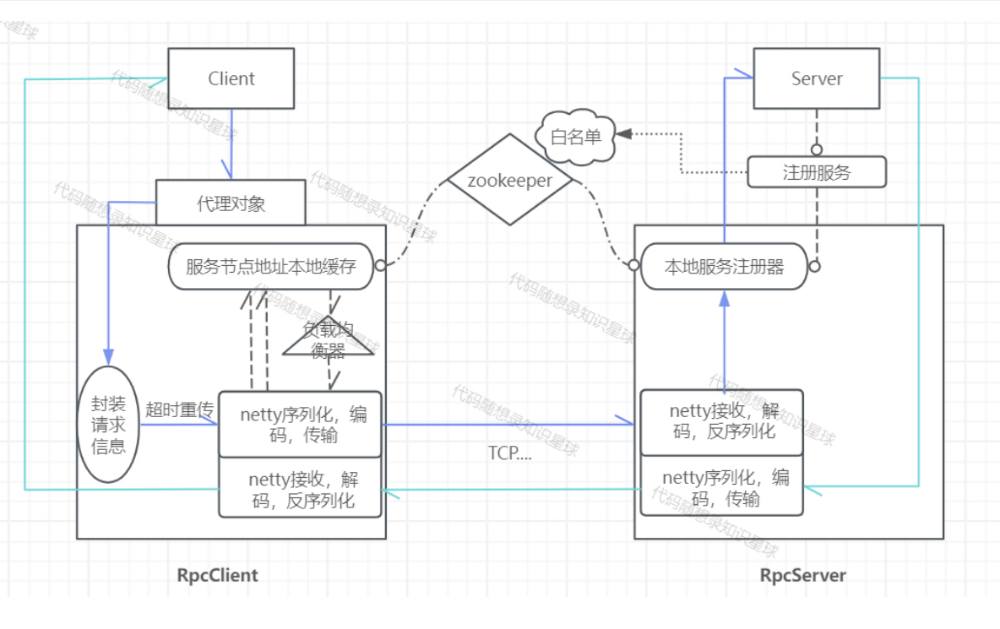
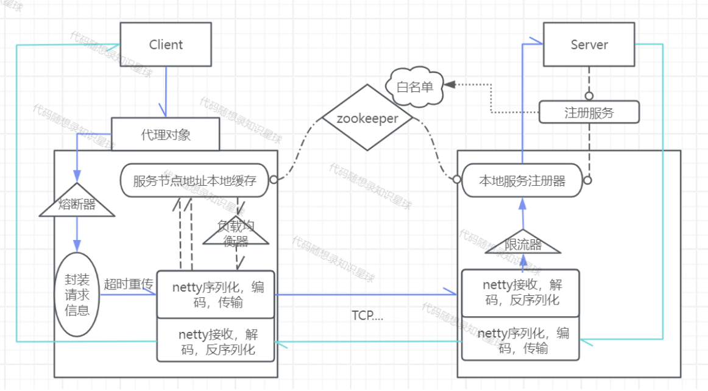
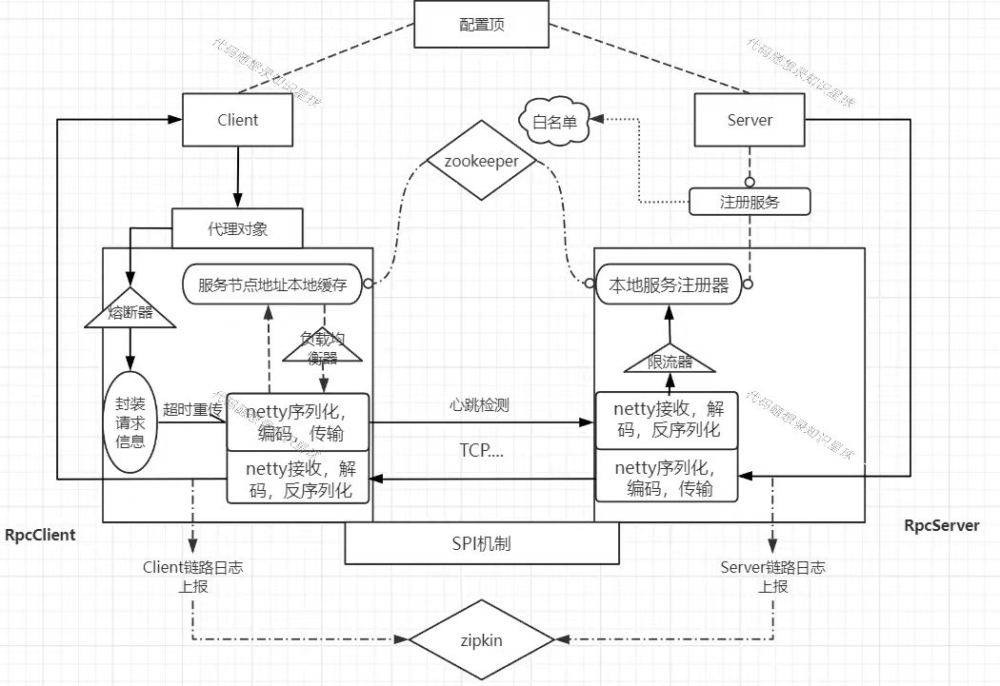

# prc-java

## version1

### part1

* 实现基本的`rpc`调用
    * 用户端使用动态代理向服务端发送请求
    * 服务端通过服务的本地注册和动态获取，通过`socket`接收用户端的请求
    * 服务端动态获取服务，通过`RpcRequest`中的信息，反射调用服务方法进行处理
* 客户端动态代理
    * 实现`InvocationHandler`接口，重写`invoke`方法，实现处理逻辑
    * 动态生成实现接口的代理对象
* 定义统一的`request` 和 `response`
    * `RpcRequest`
        * `interfaceName`
        * `methodName`
        * `params`
        * `parmsType`
    * `RpcResponse`
        * `code`
        * `message`
        * `data`

### part2

* 引入netty框架进行消息传输
    * 客户端
        * 实现`NettyClientHandler`类，继承`SimpleChannelInboundHander<RpcResponse>`类
            * 重写`channelRead0`方法，接收响应，将`RpcResponse`存储到当前`channel`中
        * 实现`NettyClientInitializer`类，继承`ChannelInitializer<SocketChannel>`类
            * 重写`initChannel`方法，初始化客户端的`channel`和`channelPipeline`
              ，自定义消息格式（长度，消息体），编码以及解码器，并将`NettyClientHandler`放入`channelPipeline`
              中
        * 实现`NettyRpcClient`类
            * `Netty`方式对客户端初始化，初始化线程池，配置对消息处理机制
            * 重写`sendRequest`，按`Netty`方式发起连接请求
    * 服务端
        * 实现`NettyRPCServerHandler`类，继承`SimpleChannelInboundHander<RpcResponse>`类
            * 重写`channelRead0`方法，接收请求，读取并调用服务，即通过反射调用服务方法处理
        * 实现`NettyClientInitializer`类，继承`ChannelInitializer<SocketChannel>`类
            * 重写`initChannel`方法，初始化客户端的`channel`和`channelPipeline`
              ，指定消息格式，编码以及解码器，并将`NettyClientHandler`放入`channelPipeline`
        * 实现`NettyRpcServer`类
            * `Netty`方式实现监听请求，用两个线程组，`bossGroup`处理客户端的请求，`workGroup`处理连接后的数据读写

### part3

* 引入`zookeeper`作为注册中心
    * 取代写死的目标ip和port，将服务的地址和端口记录到注册中心，服务端注册服务以及地址，客户端通过服务名找到对应服务端地址
    * 客户端
        * 实现`zkServiceCenter`
            * 实现`zk`客户端初始化，并与`zookeeper`服务端进行连接，指定服务的根节点
            * 实现通过服务名查找服务端地址的方法
    * 服务端
        * 实现`zkServiceRegister`
            * 实现`zk`客户端初始化，并与`zookeeper`服务端进行连接，指定服务的根节点
            * 注册服务到注册中心
        * 修改本地注册，实现本机映射同时在注册中心注册服务

## version2

### part1

* 自定义编码器，解码器，序列器
    * 序列器
        * `ObjectSerializer`类，实现`serializer`，`deserializer`
        * `JsonSerializer`类，实现`serializer`，`deserializer`
    * 编码器
        * 实现`MyEncoder`类，继承`MessageToByteEncoder`类
            * 重写`encode`方法，写入消息：消息类别，当前序列化器类型，消息的长度，消息体
    * 解码器
        * 实现`MyEncoder`列，继承`MessageToByteDecoder`类
            * 重写`decode`方法，读取消息：消息类别，当前序列化器类型，消息的长度，消息体
    * 修改客户端以及服务端的`nettyInitializer`类
        * 使用自定义的编解码器

### part2

* 客户端建立本地服务缓存
    * 创建缓存
        * 实现`serviceCache`类
            * 定义一个存储服务名以及地址列表的Map变量
            * 实现添加服务方法
            * 实现修改服务方法
            * 实现从缓存中取服务地址方法
            * 实现从缓存中删除服务地址方法
    * 修改`serviceCenter`类，找服务地址时，先在本地缓存中找，找不到取`zookeeper`中找
* 实现本地缓存的动态更新
    * 使用`zookeeper`的事务监听机制，通过注册中心注册`Watcher`，监听注册中心的变化，实现本地缓存的动态更新
        * 实现`watchZK`类，对节点进行路径下的节点进行监听，根据节点变化进行更新缓存
        * 修改`zkServiceCenter`类，初始化`zookeeper`客户端中添加初始化缓存，加入`zookeeper`事件监听器

## version3

### part1

* 实现客户端的负载均衡
    * 负载均衡算法
        * 轮询法 `RoundLoadBalance`类
        * 随机法 `RandomLoadBalance`类
        * 一致哈希法 `ConsistencyHashBalance`类
            * 实现`init`方法，将真实节点和虚拟节点添加到哈希环，添加一个真实节点同时会添加多个虚拟节点
            * 实现`getServer`方法，根据请求选择一个服务节点，其中得通过`hash`值来找
            * 实现`balance`方法，根据一致哈希选择服务
    * 修改`serviceCenter`类，负载均衡得到地址

### part2

* 超时重传&白名单
    * 白名单
        * 将可以进行超时重传的服务放到`zookeeper`中，指定根节点
        * 注册服务时，将可重试的方法放到白名单中
    * 超时重传
        * 当调用端发起的请求失败时，可以进行重试，再发送请求
        * 使用`Guava Retry`，实现`guavaRetry`类，设置重试机制
            * 对那些异常进行重试
            * 对不符合预期的返回结果进行重试
            * 设置重试监听器
            * 设置重试等待策略
            * 设置停止重试策略 ...
        * `retryer.call`执行RPC请求，进行重试
        * 修改`serviceCenter`，添加`checkRetry`方法，判断是否可重试，其中在`zookeeper`中是否能找到

## version4

### part1

* 服务限流，降级的实现 - 服务端
    * 限流算法
        * 计数器法
        * 滑动窗口算法
        * 漏桶算法
        * 令牌桶算法
            * 桶最大容量n，每秒产生r令牌，可以保证瞬时速率，也可保证平均速率
            * 实现`TokenBucketRateLimitImpl`类，继承`RateLimit`，实现`boolean getToken()`方法，根据当前令牌桶中容量以及上次生成令牌的时间戳判断获取令牌
            * 实现`RateLimitProvider`类，根据接口名称获取`RateLimit`，没有就创建
    * 修改`NettyRPCServerHandler`类，增加限流逻辑，反射调用之前判断是否被限流
* 熔断器的实现 - 客户端
    * 熔断请求判断机制算法
        * 实现`CircuitBreaker`类，计数失败请求，成功请求，请求总数，根据失败阈值，半开状态下的成功率阈值，重置时间周期进行判断是否允许请求
        * 实现`CircuitBreakerProvider`类，根据服务名获取对应的熔断器，不存在就创建一个新的
        * 修改`ClientProxy`类，增加熔断逻辑，`sendRquest`之前判断是否允许通过
    * 熔断恢复
        * `CircuitBreaker`类中实现记录成功的请求以及失败的请求，根据不同熔断器状态下，对比阈值后修改熔断器状态

## version5

## part1

* 配置顶
  * 实现`KRpcConfig`类，包含名称，端口，主机名，版本号，注册中心，序列化器，负载均衡
  * 实现`ConfigUtil`类，加载配置文件，获得转化后的配置对象
  * 实现`KRpcApplication`类，维护全局对象
* 添加序列化方式
  * Hessian
  * Kryo
  * Protostuff
* SPI机制
  * 配置文件序列化名->对应序列化对象的映射
* 日志链路追踪实现
  * `Snowflake`算法生成`Trace ID`
  * 实现`TraceIdGenerator`类，生成`traceId`生成器，获取生成的`traceId`，`spanId`
  * 使用`MDC`保存链路消息，实现`TraceContext`封装`MDC`操作
  * `zipkin`数据上报，实现`ZipkinReporter`类，与`zipkin`数据交互
    * 初始化`Zipkin`上报器
    * 上报`span`数据到`Zipkin`
  * 创建客户端和服务端拦截器，上报`span`数据
    * 客户端 `clientTraceInterceptor`类
      * `beforeInvoke`方法，初始化和保存链路数据到MDC
      * `afterInvoke`方法，上报链路数据
    * 服务端 `serverTraceInterceptor`类 
      * `beforeInvoke`方法，获取和生成链路数据
      * `afterInvoke`方法，上报链路数据
  * 选择合适位置，拦截和上报
    * 客户端
      * 发起请求前，设置`spanId`，`traceId`
      * 请求返回时上报数据
    * 服务端
      * 接收客户端请求时，获取数据
      * 返回时上报
  * 持有和传递日志数据
    * 客户端的`traceId`和`spanId`需要传递到服务端，即添加到编解码器中
      * 编码器
        * 写入`traceMsg`消息长度
        * 写入`traceMsg`消息体
      * 解码器
        * 读取`traceMsg`消息长度
        * 读取`traceMsg`消息体
    * 由于`MDC`数据是当前线程中的，`Netty`传输数据会启动新的进程，关联一个`channel`，所以需要将主线程中的`MDC`同步给`netty`的`MDC`
      * 实现`MDCChannelHandler`类，继承`ChannelOutboundHandlerAdapter`类
        * 重写`write`方法，从`channel`属性中得到`Trace`上下文，同步到当前进程中
      * `NettyClientInitializer`类中，添加`MDCChannelHandler`
      * 发送请求时设置`channel`属性，将当前`Trace`上下文设置到`channel`属性中，否则`MDCChannelHandler`找不到
* 心跳检测
  * 修改`Request`，添加类型属性，常规/心跳包 
  * 客户端 关注写空闲事件
    * 实现`heartBeatHandler`类，继承`ChannelDupexHandler`类
      * 重写`userEventTiggered`方法，获得当前`IdleState`，如果为写空闲事件，发送心跳包
    * 添加到`NettyClientInitalizer`中，添加组件，只关注写事件，设置超时时间
  * 服务端 关注写空闲事件和读空闲事件
    * 实现`heartBeatHandler`，继承`ChannelDupexHandler`类
      * 写`userEventTiggered`方法，获得当前`IdleState`，如果为写空闲事件，关闭连接，如果为读空闲事件，关闭连接
    * 添加到`NettyServerInitalizer`中，添加组件，只关注读事件和写事件，设置超时事件
  * 修改`server`端逻辑，`NettyRpcServerHandler`中，判断如果请求类型为心跳包，直接返回空 
* 基于方法白名单的重试机制
  * 自定义注解`@Retryable`
  * 注册服务时，扫描接口下的函数中是否有`@Retryable`注解，有就注册到白名单中

